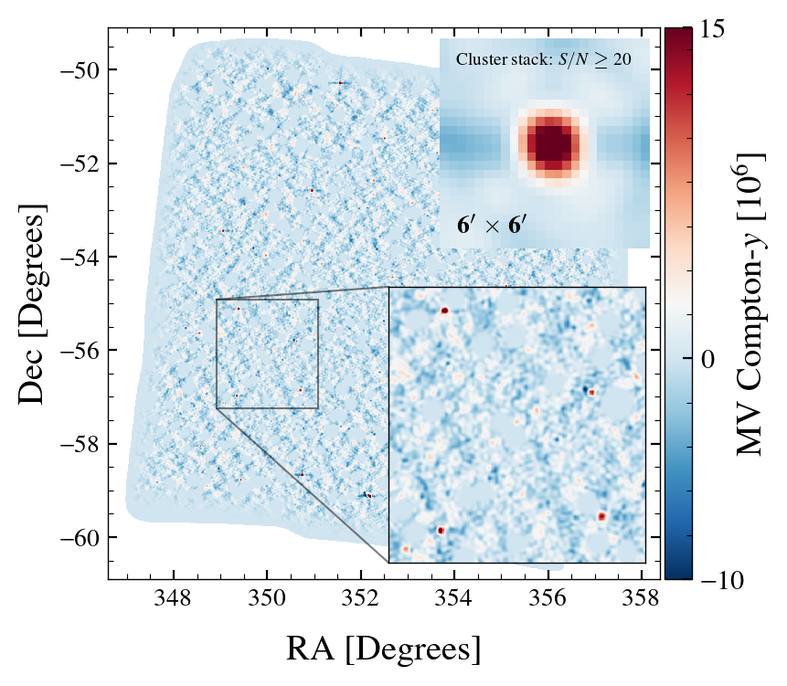
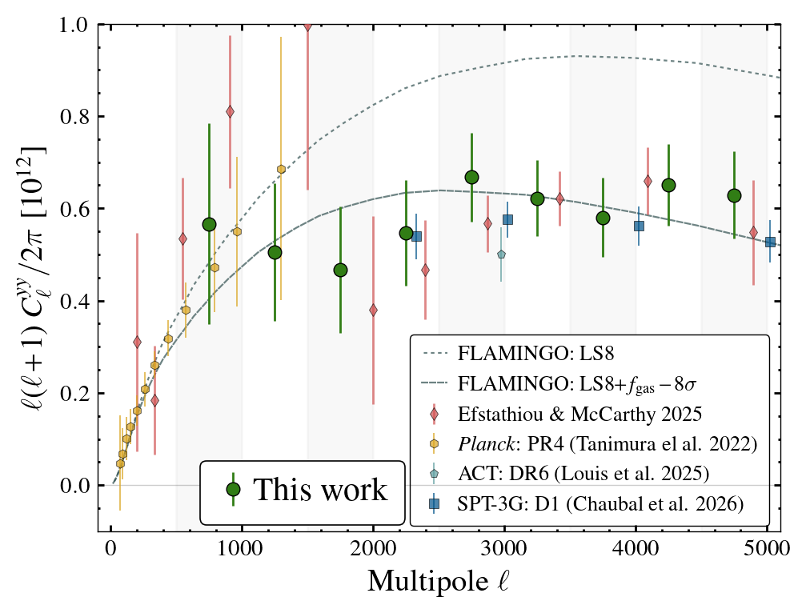
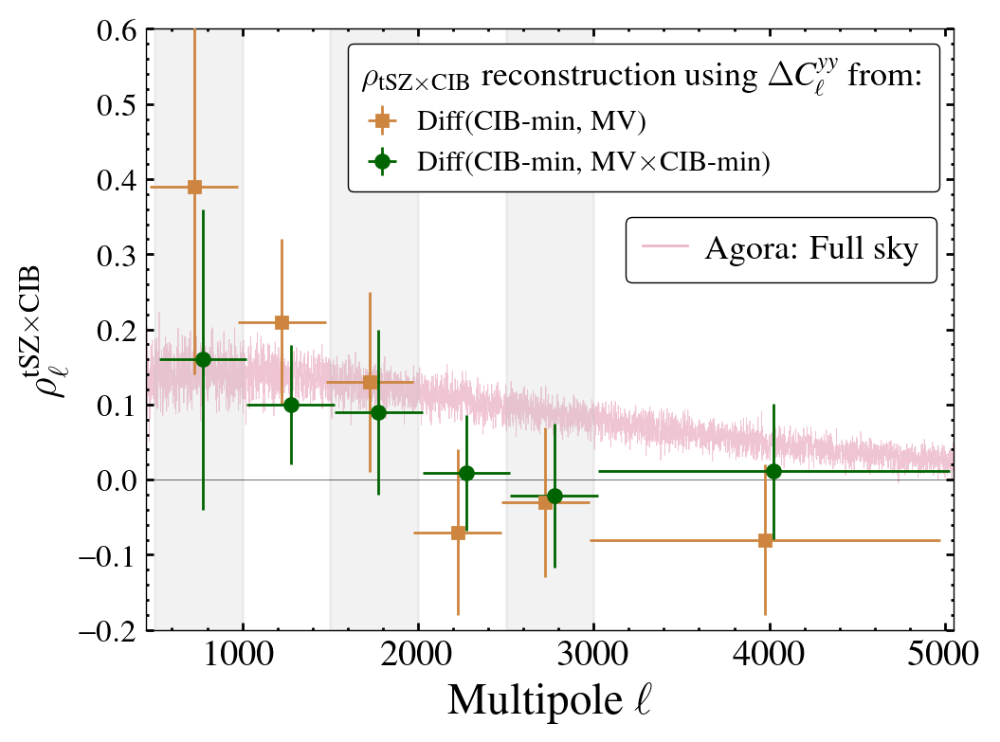

# tSZ 2pt analysis using SPT x SPIRE
## Paper:
* Raghunathan S., SPT-3G and SPTpol Collaboration 2026; arXiv:[2403.02337](https://arxiv.org/abs/xxxx.xxxxx).

## Overview:
* In this work, we reconstruct the full shape of the thermal Sunyaev–Zeldovich (tSZ) or Compton-$y$ power spectrum by optimally combining data from the South Pole Telescope (SPT) and *Herschel*-SPIRE surveys. 
* We release the bandpowers, maps, and other associated data products here.

## Results:

### Code:
* [read\_maps\_masks\_bandpowers\_cov.ipynb](https://github.com/sriniraghunathan/tSZ_2pt_SPT_SPIRE/blob/main/read_maps_masks_bandpowers_cov.ipynb): Please look into this notebook to read the data products.
	* Html rendering of the above notebook: [Link](https://pole.uchicago.edu/public/data/tsz_2pt_raghunathan26/read_maps_masks_bandpowers_cov.html) 	

### Maps:

  

* We release two versions of the Compton-$y$ maps. Both these versions have the "full coadd", as well as two half-splits. These can be found inside [maps\_and\_masks] (https://github.com/sriniraghunathan/tSZ_2pt_SPT_SPIRE/tree/main/maps_and_masks) folder.
	* MV: minimum-variance (MV) linear combination (LC).
	* CIB-min: The LC combination in which the cosmic infrared background (CIB) signal is minimised.

### Bandpowers:

  

* We also release the associated bandpowers along with the bandpower covariance and the bandpower window functions. These can be found under [bandpowers\_and\_cov] (https://github.com/sriniraghunathan/tSZ_2pt_SPT_SPIRE/tree/main/bandpowers_and_cov) folder. They contain:
	* Auto-power spectrum of CIB-min and MV maps, as well as the cross-spectrum between CIB-min and MV maps.

### tSZ $\times$ CIB cross-correlation:

  
  

